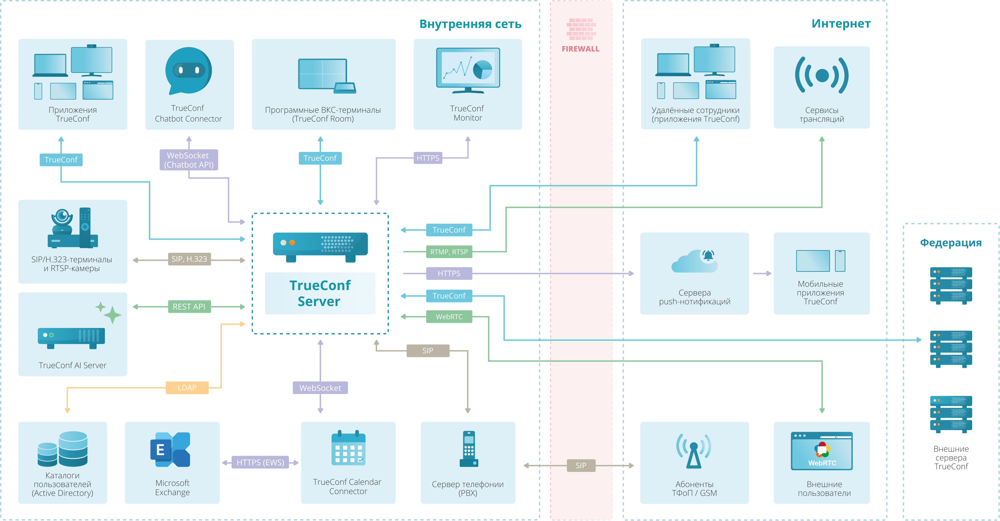

### Практическая работа №2 — Разработка регламента управления ИТ-сервисом

Поле | Значение |
|---|---|
|Продукт и тип бизнеса| Разработка программного обеспечения. Продажа срочных\бессрочных лицензий и услуг технической поддержки пользователей |
|Разбираемый ИТ-сервис| Техническая поддержка пользователей TrueConf Server |
|Годовой оборот и способ подтверждения| Выручка 2025 - 484 млн руб. 2024 - 122 млн руб. [Ссылка](https://www.audit-it.ru/buh_otchet/7728361647_ooo-trukonf) |
|Пользователи и нагрузка| В 2024 году продуктами компании пользуются более 10 000 организаций в России и странах СНГ. > 10 млн. групповых ВКС ежемесячно |
|Режим данных| Реальные данные + оценочные |

### Архитектура продукта и окружение

**Архитектура продукта**

TrueConf Server — основная служба

TrueConf Database — служба сервера базы данных

TrueConf Web Manager — отвечает за работу панели управления TrueConf Server, гостевой страницы, личного кабинета, планировщика, веб-приложения (подключение к конференции через браузер по WebRTC), также отвечает и за настройки HTTPS.

TrueConf Server Manager — менеджер работы с реестром Windows и файлами настроек.

TrueConf Bridge — служба, которая получает web socket-сообщения (команды) от веб-приложений и преобразовывает их в понятные для TrueConf Server транспортные сообщения.

**Размещение и взаимодействие**:

**Зона ответственности**
|Компонент | Зона ответственности |	Описание |
|---|---|---|
|TrueConf Server (Web Manager, Server Manager, Bridge) |  поддерживается TrueConf  | разрабатываемый нами продукт |
|TrueConf Database | поддерживается TrueConf | В качестве СУБД используется PostgreSQL |
| Аппаратная и программная часть на сервере размещения |	Клиент/Заявитель | Не обслуживаем и не консультируем инфраструктуру заказчика |
| Каналы связи	|	Клиент/Заявитель | Не обслуживаем и не консультируем инфраструктуру заказчика |
| Телефония |	Клиент/Заявитель | Не обслуживаем и не консультируем инфраструктуру заказчика |
| Почта|	Клиент/Заявитель | Не обслуживаем и не консультируем инфраструктуру заказчика |
| LDAP каталог|	Клиент/Заявитель | Не обслуживаем и не консультируем инфраструктуру заказчика |

### Каталог услуг и типы обращений 

**Каталог услуг (Тип системы | Услуга )**:

* TrueConf Server
    - Консультирование по настройке, установке, обновлению  
        * Тип Consultation
        * Время обработки в соответствии с таблицей "Время реакции"
    - Консультирование по интеграции с ИТ-системами и протоколами
        * Тип Consultation
        * Время обработки в соответствии с таблицей "Время реакции"
    - Консультирование интеграции с ИБ-системами и протоколами  
        * Тип Consultation
        * Время обработки в соответствии с таблицей "Время реакции"
    - Доступ к документации и обучающим материалам 
        * Тип Consultation
        * Время обработки в соответствии с таблицей "Время реакции"
    - Устранение сбоя в работе системы 
        * Тип Инцидент 
        * Критичность определяется в соответствии с Матрицей приоритезации
        * Время обработки зависит от критичности, информация приведена в таблице "Время реакции"
    - Развитие функционала системы 
        * Тип Нормальное изменение
        * Время обработки в соответствии с таблицей "Время реакции"
    - Брендирование интерфейса в корпоративный стиль 
        * Тип Стандартное изменение
        * Время обработки в соответствии с таблицей "Время реакции"
    - Автоматизация развертывания и настройки (Подготовка пакетов, скриптов установки и настройки ПО)
        * Тип Стандартное изменение
        * Время обработки в соответствии с таблицей "Время реакции"
* TrueConf Kiosk, Room, Videobar
    - Консультирование по настройке, установке, обновлению 
        * Тип Consultation
        * Время обработки в соответствии с таблицей "Время реакции"
    - Доступ к документации и обучающим материалам  
        * Тип Consultation
        * Время обработки в соответствии с таблицей "Время реакции"
    - Устранение сбоя в работе системы 
        * Тип Инцидент
        * критичность определяется в соответствии с Матрицей приоритезации
        * Время обработки зависит от критичности, информация приведена в таблице "Время реакции"
    - Развитие функционала системы 
        * Тип Нормальное изменение
        * Время обработки в соответствии с таблицей "Время реакции"
    - Брендирование интерфейса в корпоративный стиль 
        * Тип Стандартное изменение
        * Время обработки в соответствии с таблицей "Время реакции"
    - Автоматизация развертывания и настройки (Подготовка пакетов, скриптов установки и настройки ПО) 
        * Тип Стандартное изменение
        * Время обработки в соответствии с таблицей "Время реакции"
* TrueConf Calendar Connector
    - Консультирование по настройке, установке, обновлению 
        * Тип Consultation
        * Время обработки в соответствии с таблицей "Время реакции"
    - Консультирование по интеграции с ИТ-системами и протоколами 
        * Тип Consultation
        * Время обработки в соответствии с таблицей "Время реакции"
    - Доступ к документации и обучающим материалам  
        * Тип Consultation
        * Время обработки в соответствии с таблицей "Время реакции"
    - Устранение сбоя в работе системы  
        * Тип Инцидент
        * Критичность определяется в соответствии с Матрицей приоритезации
        * Время обработки зависит от критичности, информация приведена в таблице "Время реакции""
    - Развитие функционала системы 
        * Тип Нормальное изменение
        * Время обработки в соответствии с таблицей "Время реакции"
    - Автоматизация развертывания и настройки (Подготовка пакетов, скриптов установки и настройки ПО) 
        * Тип Стандартное изменение
        * Время обработки в соответствии с таблицей "Время реакции"
* TrueConf Monitor
    - Консультирование по настройке, установке, обновлению 
        * Тип Consultation
        * Время обработки в соответствии с таблицей "Время реакции"
    - Консультирование по интеграции с ИТ-системами и протоколами 
        * Тип Consultation
        * Время обработки в соответствии с таблицей "Время реакции"
    - Доступ к документации и обучающим материалам  
        * Тип Consultation
        * Время обработки в соответствии с таблицей "Время реакции"
    - Устранение сбоя в работе системы 
        * Тип Инцидент
        * Критичность определяется в соответствии с Матрицей приоритезации
        * Время обработки зависит от критичности, информация приведена в таблице "Время реакции"
    - Развитие функционала системы 
        * Тип Нормальное изменение
        * Время обработки в соответствии с таблицей "Время реакции"
    - Брендирование интерфейса в корпоративный стиль 
        * Тип Стандартное изменение
        * Время обработки в соответствии с таблицей "Время реакции"
    - Автоматизация развертывания и настройки (Подготовка пакетов, скриптов установки и настройки ПО) 
        * Тип Стандартное изменение
        * Время обработки в соответствии с таблицей "Время реакции"
* TrueConf AI Server
    - Консультирование по настройке, установке, обновлению 
        * Тип Consultation
        * Время обработки в соответствии с таблицей "Время реакции"
    - Консультирование по интеграции с ИТ-системами и протоколами 
        * Тип Consultation
        * Время обработки в соответствии с таблицей "Время реакции"
    - Доступ к документации и обучающим материалам  
        * Тип Consultation
        * Время обработки в соответствии с таблицей "Время реакции"
    - Устранение сбоя в работе системы 
        * Тип Инцидент
        * Критичность определяется в соответствии с Матрицей приоритезации
        * Время обработки зависит от критичности, информация приведена в таблице "Время реакции"
    - Развитие функционала системы  
        * Тип Нормальное изменение
        * Время обработки в соответствии с таблицей "Время реакции"
    - Брендирование интерфейса в корпоративный стиль 
        * Тип Стандартное изменение
        * Время обработки в соответствии с таблицей "Время реакции"
    - Автоматизация развертывания и настройки (Подготовка пакетов, скриптов установки и настройки ПО) 
        * Тип Стандартное изменение
        * Время обработки в соответствии с таблицей "Время реакции"

За актуализацию каталога услуг несет ответственность руководитель технической поддержки пользователей.

Обрабатываемые обращения могут быть трех типов:
1. Запрос на обслуживание — это запрос не связанные с нарушением работоспособности Продукта. К ним относятся запросы на информацию, консультацию, предоставления доступа к базе знаний и проведение обучения.  Запрос на обслуживание имеют тип __Consultation__
2. Инцидент — это любое незапланированное прерывание работы или снижение качества работы программного обеспечения и устройств, поставляемых компанией. Инциденты могут быть 3 уровней, матрица приоритезации рассмотрена ниже.
3. Изменение - Доработка, развитие функциональности системы, исправление ошибок на уровне кода программного обеспечения. Запросы на изменение могут быть инициированы только сотрудниками компании. 

Несколько однотипных инцидентов имеющих одни и те же причины должны объединяться в проблему.

**Матрица приоритезации инцидентов**
|Состояние ↓ / Функционал/продукт →|  TrueConf Server (ВКС) |	 TrueConf Server(Чаты)  | TrueConf Server(другое) |   TrueConf  другие системы | Клиентские приложения TrueConf |
|--|--|--|--|--|--|
|Полная неработоспособность | Critical | Major | Major | Minor | Minor | Minor |
|Частичная неработоспособности\деградация |	Major | Major | Minor | Minor | Minor | Minor |
|Незначительное влияние на работоспособность| Major | Minor | Minor | Minor | Minor | Minor |

**Время реакции**
|Степени критичности | Время реакции Расширенный* | Время реакции Полный+* | Время реакции Премиум|
|-|-|-|-|
|Critical|6 рабочих часа| 4 рабочих часа| 2 часа |
|Major|  8 рабочих часов | 6 рабочих часов | 4 часов |
|Minor| 12 рабочих часов | 8 рабочих часов| 6 рабочих часов|
|Consultation| 16 рабочих часов | 10 рабочих часов | 8 рабочих часов|
|Стандартное изменение| 16 рабочих часов | 10 рабочих часов | 8 рабочих часов|

*Время реакции рассчитывается по московскому времени. Рабочие часы с 9:00 до 19:00.

Контроль за соблюдением времени выполнения осуществляет руководитель технической поддержки пользователей. 

**Запросы на изменение**
|Категория | Признак | 	Результат |
|-|-|-|
|Изменение конфигурации | Изменение конфигурации аппаратной либо программной части ОС, ПО, серверов и сетевого оборудования командой эксплуатации | План работ с конфигурациями и этапами изменения |
|Стандартное| типовые изменения в Программном продукте   | Сценарий/скрипт настройки сервиса |
|Нормальное| 	Добавление нового функционала | Кумулятивные мажорное обновление |
|Экстренное| 	Исправление выявленных багов | Минорное обновление |

### Маршрутизация по линиям и ключевые роли 

**Уровни Технической поддержки и Процедура эскалации запросов на обслуживание и инцидентов**:

| Расширенный и Полный+ | Премиум |  Роль | Триггер |
|-|-|-|-|
|Уровень 1 |     -      | Команда Специалистов (L1) | Регистрация и обработка запросов клиентов с уровнем Расширенный и Полный+ |
|Уровень 2 | Уровень 1  | Команда Экспертов (L2)    | Регистрация и обработка запросов клиентов с уровнем Премиум. Остальные запросы если не решено за 60% целевого времени реакции |
|Уровень 3 | Уровень 2  | Команда Разработки (L3)   | Выявление и исправление ошибок в программном коде программы |

**Маршрут согласования изменений**:

Формат маршрута: __(Тип изменения) Инициатор  ->  Описание задачи ->   1 этап согласования ->  2 этап согласования ->  3 этап согласования ->   Исполнитель работ -> Информирование о выполнении__

* (Изменение конфигурации) Команда эксплуатации инфраструктуры -> Команда эксплуатации инфраструктуры  ->  Руководитель ИТ инфраструктуры  ->   Специалист ИБ  -> - ->  Команда эксплуатации инфраструктуры ->  -
* (Стандартное изменение) Премиум клиент  -> Эксперт (L2) ->  Руководитель технической поддержки пользователей  ->  Дежурный разработчик (L3)  -> - ->  Эксперт (L2) -> Премиум клиент
* (Нормальное изменение) Владелец продукта, Клиенты, Сотрудники компании -> Системный архитектор -> Специалист по ИБ + Руководитель ИТ инфраструктуры  ->  Технический лидер  -> Владелец продукта ->  Разработчик (L3) -> Все пользователи
* (Экстренное изменение) Эксперт (L2) -> Дежурный разработчик (L3) ->  Специалист ИБ  -> Технический лидер -> - ->  Разработчик (L3) -> Все пользователи

1. *Специалист технической поддержки (L1)*

Операционные задачи - 	Анализ поступивших обращений, первичная диагностика, решение типовых запросов, создание статей в базе знаний для пользователей с описанием решения типовых вопросов (решение о публикации принимает Команда Экспертов)

Стратегические задачи - обработка и решение обращений в отведенный срок.

Полномочия - Решение запросов с типом Consultation, диагностика и решение инцидентов Minor и Major для пользователей с уровнем технической поддержки Расширенный и Полный+. 

Эскалация - сразу если тип поддержки у клиента Премиум либо тип обращения "Изменение". В остальных случаях, если не решено за 60% целевого времени реакции. 

Входные данные: обращение через ServiceDesk / e-mail / телефон

Критерии приёма: наличие описания проблемы, контактных данных, версии ПО, логов (при наличии). Если данных не хватает, то информация дозапрашивается у заявителя. 

Последовательность действий:
* Классифицировать обращение. Указать систему, услугу. Выбрать тип: инцидент / запрос на обслуживание / изменение. Если инцидент, то определить приоритет по матрице.
* Провести анализ полученной информации -> поиск решения в базе знаний -> попытаться решить своими силами.
- Есть решение в базе знаний, либо удалось самим разобраться -> закрыть обращение -> Подготовить статью для базы знаний если инцидент не описан, но встречается не первый раз. 
- Если решить своими силами не удалось за 60% отведенного времени либо запрос от Премиум -> Добавить всю собранную/полученную информацию в заявку и передать на L2.

Выходные данные: Закрытое обращение с решением. Подготовленная к передаче на следующую линию заявка (при Эскалации). Черновик статьи в базе знаний.

2. *Эксперт технической поддержки (L2)*

Операционные задачи - Глубокая диагностика, обходные решения, работа с запросами от Премиум, подготовка и проведение стандартных изменений.

Стратегические задачи - Анализ трендов, ведение проблем, развитие базы знаний и обучающих курсов. 

Полномочия - Закрывать обращения любых типов. Регистрировать Экстренные изменения, регистрировать и выполнять Стандартные изменения. Валидировать, изменять и управлять доступами к статьям в базе знаний. Управлять Проблемами.

Эскалация - Запросы на изменение (Нормальное, Экстренное).

Входные данные: эскалированный тикет от L1.

Критерии приёма: наличие описания проблемы, логов, конфигурации, скриншотов ошибок, список шагов для воспроизведения.

Последовательность действий при обработке запросов:
* Проверить полноту данных; при нехватке — запросить у L1. Для Премиум клиентов запрашиваем напрямую у заявителя. 
* Воспроизвести ошибку (если возможно) на тестовом стенде.
* Проанализировать логи, дампы, конфигурацию.
- Если причина — конфигурация -> предложить решение.
- Если причина — ошибка в коде -> описать выявленный дефект и эскалировать на Дежурного разработчика. Все инциденты связанные с ошибкой необходимо объединить в Проблему.
- Если причина — внешняя -> уведомить Заказчика, закрыть с пояснением.
* Подготовить/провалидировать статью в базу знаний (при необходимости).

Для стандартных изменений:
* Оценка стандартного изменения
* Дозапрос информации у заявителя
* Использование готового шаблона + оптимизация под конкретного заказчика
* Отправка на согласование 
- Если согласовано -> отправка инструкций и артефактов заявителю
- Если не согласовано -> исправляются замечания  

Выходные данные: решение / обходное решение / эскалация на L3. Готовая статья в базе знаний. Артефакт в результате стандартного изменения + инструкция.

3. *Разработчик (L3)*

Операционные задачи - Исправление ошибок в коде, выпуск патчей, разработка функционала системы.

Стратегические задачи - подготовка релизов.

Полномочия - разработка релизов для продукта.

Эскалация - Нормальные изменения.

Входные данные: Экстренное изменение - тикет от Дежурного Разработка с подтверждённой ошибкой и описанием проблемы.  Нормальное изменение - техническое задание на разработку от системного архитектора 

Критерии приёма: Экстренное изменение - наличие воспроизведения, логов, версии ПО. Нормальное изменение - наличие согласования и достаточность описания функционала.

Последовательность действий:
* Берут задачи в работу из согласованного пула. 
* Протестировать исправление/изменение.
* Описать техническую часть
* Результат работы (патч / минорное или мажорное обновление) выгрузить в репозиторий.
* Уведомить L2 об исправлении/изменении. Привлечь аналитика и SMM|PR для подготовки информационного уведомления пользователей.

Выходные данные: артефакт 

4. *Дежурный Разработки (L3)*

Операционные задачи - Валидация стандартных изменений. Проверка обходных решений при выявлении бага и регистрация Экстренных изменений. Консультирование L2.

Стратегические задачи - Связующее звено между L2 и L3.

Полномочия - Принимает решения о возможности предоставления заказчику стандартного изменения. Разработка обходного решения при возникновении инцидентов из-за ошибок, связанных с программной частью.

Эскалация - нет

Входные данные: От L2. Стандартные изменения - заявка в HelpDesk, оптимизированный под заявителя скрипт\playbook + ссылка на инструкцию с описанием шагов. Экстренные изменения - описание выявленного дефект и результаты воспроизведения в тестовой среде. 

Последовательность действий:
* Если требуется - Проверка на тестовой среде воспроизведения ошибки или сценария настройки (для стандартного изменения).
* Для Экстренное изменение
- Оценить сложность и риск исправления, подготовить план работ и отправить на согласование
- Разработка обходного решения совместно с L2
* Для стандартного изменения
- Принятие решения о предоставлении пользователю.

Выходные данные: задача по устранению ошибки в коде, согласование стандартного изменения.  

5. *Специалист по информационной безопасности*

Операционные задачи - Проверка релизов на наличие уязвимостей, участие в разборе инцидентов информационной безопасности, контроль за действиями разработчиков и администраторов в продуктивной среде, анализ и согласование изменений.

Стратегические задачи - Внедрение практик безопасной разработки, Проактивное управление рисками информационной безопасности, защита ключевых активов организации. 

Полномочия	Самостоятельно - Согласование переноса релиза из тестовой среды в прод. Согласование внесения изменений в продуктивные информационные системы. 

Входные данные: запрос на согласование Плана работ по внесению изменений в инфраструктуру либо согласование переноса содержимого коммита из теста в прод.

Критерии приёма: описание предлагаемых изменений, описание технической реализации используемых инструментов и технологий.

Эскалация - нет

Последовательность действий:
* Классифицировать изменение.
* Оценить необходимость, риски, трудозатраты и эффекты.
* Разделить изменения на релизы
* Согласовать изменения вошедшие в ближайший релиз  
* Зафиксировать результат после выполнения.

Выходные данные: задание на разработку (список изменений, согласованных для следующего релиза)

6. *Владелец продукта*

Операционные задачи - оценка риска, планирование и утверждение изменений

Стратегические задачи - Развитие продукта, планирование релизов

Полномочия	Самостоятельно - принятие решений о развитии продукта.

Входные данные: дорожная карта развития продукта 

Критерии приёма: описание потребности, технической реализации + трудозатраты. 

Последовательность действий:
* Классифицировать изменение.
* Оценить необходимость, риски, трудозатраты и эффекты.
* Разделить изменения на релизы
* Согласовать изменения вошедшие в ближайший релиз  
* Зафиксировать результат после выполнения.

Выходные данные: задание на разработку (список изменений, согласованных для следующего релиза)

### Таблица соответствия «Параметр SLA — Практика — Роль»

|Параметр SLA| Практика | Роль |
|--|--|--|
|Время и процесс обработки инцидентов и запросов на обслуживание | Incident management, Problem management | L1, L2 |
|Каталог услуг и границы сервиса | Service request management | Руководитель технической поддержки |
|Процедура эскалации | Incident management | L1, L2, L3 |
|База знаний и обучающие материалы для администраторов | Knowledge Management | L1, L2 |
|Процедура обновления ПО | Change enablement | L3, Комитет по изменениям |
|Целевые уровни обслуживания | Service level management, Monitoring and event management | Руководитель технической поддержки |
